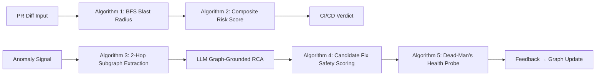
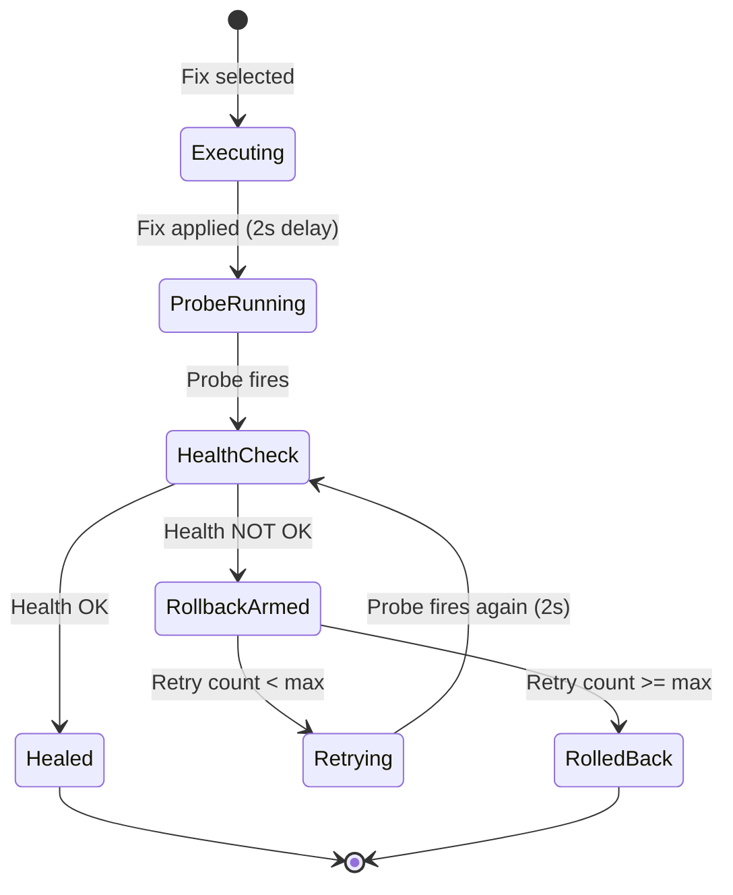

# AEGIS Custom Algorithms Specification

> **Project**: AEGIS — Autonomous Engineering Graph & Intelligence System  
> **Scope**: All custom-built algorithms used in the Review 2 Prototype  
> **Purpose**: Document the mathematical formulas, pseudocode, and acceptance criteria for every non-trivial algorithm so implementation can proceed without ambiguity.  
> **Last Updated**: 27th September 2026

---

## Overview

AEGIS uses **three core algorithms** and **two supporting algorithms** that are custom-built (not sourced from libraries). These operate on the Knowledge Graph (NetworkX in-memory / Neo4j) and power both the pre-deployment risk prediction and the post-deployment autonomous healing pipeline.



---

## Algorithm 1: Downstream Blast Radius — BFS with Depth Attenuation

### Purpose
When a pull request modifies a target service or API contract, determine all transitively impacted downstream services by traversing `CALLS` and `DEPENDS_ON` edges using Breadth-First Search. Impact weight attenuates with depth to reflect diminishing real-world blast propagation.

### Mathematical Model

Given a directed graph $G = (V, E)$ where $V$ is the set of service/database nodes and $E$ is the set of typed edges (`CALLS`, `DEPENDS_ON`):

$$\text{ImpactWeight}(v, d) = w_0 \times \alpha^d$$

Where:
- $v$ = impacted node
- $d$ = BFS depth from the changed node (0-indexed)
- $w_0 = 1.0$ = initial weight at the source node
- $\alpha = 0.75$ = attenuation factor per depth level
- $d_{\max} = 3$ = maximum traversal depth

### Pseudocode

```python
def compute_blast_radius(graph: DiGraph, changed_node_id: str, max_depth: int = 3, attenuation: float = 0.75) -> dict:
    """
    Traverse upstream dependents of the changed node via BFS.
    Returns: { node_id: { depth: int, impact_weight: float } }
    """
    impacted = {changed_node_id: {"depth": 0, "impact_weight": 1.0}}
    queue = deque([(changed_node_id, 0, 1.0)])
    
    while queue:
        current, depth, weight = queue.popleft()
        
        if depth >= max_depth:
            continue
        
        # Traverse UPSTREAM: services that CALL or DEPEND ON the current node
        for predecessor in graph.predecessors(current):
            if predecessor not in impacted:
                attenuated_weight = weight * attenuation
                impacted[predecessor] = {
                    "depth": depth + 1,
                    "impact_weight": round(attenuated_weight, 4)
                }
                queue.append((predecessor, depth + 1, attenuated_weight))
    
    return impacted
```

### Edge Traversal Rules

| Edge Type | Direction | Traversed? | Rationale |
|:----------|:----------|:-----------|:----------|
| `CALLS` | Predecessor → Current | ✅ Yes | A service calling the changed service is directly impacted |
| `DEPENDS_ON` | Predecessor → Current | ✅ Yes | A service depending on the changed DB/service is impacted |
| `EXPOSES` | Current → APIEndpoint | ❌ No | API endpoints are leaves, not propagation vectors |
| `INSTANCE_OF` | Pod → Service | ❌ No | Pods inherit parent service impact implicitly |

### Worked Example

```
Graph: APIGateway → OrderService → PaymentService → PostgreSQL(Payments)

Changed Node: PaymentService
Max Depth: 3, Attenuation: 0.75

BFS Result:
  PaymentService:      depth=0, weight=1.000  (source)
  OrderService:        depth=1, weight=0.750  (calls PaymentService)
  APIGateway:          depth=2, weight=0.563  (calls OrderService)
  AnalyticsWorker:     depth=1, weight=0.750  (calls PaymentService)
  
Total impacted: 4 nodes (out of 8 services)
Blast Radius Index B = (4 / 8) × 100 = 50.0
```

### Acceptance Criteria

- [ ] BFS traverses `CALLS` and `DEPENDS_ON` edges in the predecessor (upstream) direction
- [ ] Impact weight attenuates by exactly `0.75×` per depth level
- [ ] Traversal stops at `max_depth=3` — no deeper exploration
- [ ] Cyclic graphs do not cause infinite loops (visited set prevents revisits)
- [ ] Isolated nodes (no predecessors) return only themselves with weight 1.0
- [ ] Returns a dict mapping `node_id → { depth, impact_weight }`
- [ ] Time complexity: $O(V + E)$ — single BFS pass

---

## Algorithm 2: Pre-Deployment Composite Risk Scoring

### Purpose
Compute a single numerical risk score $R \in [0, 100]$ for a proposed pull request by combining four weighted risk factors derived from the Knowledge Graph.

### Mathematical Formula

$$R = w_B \cdot B + w_C \cdot C + w_D \cdot D + w_H \cdot H$$

Where:

| Factor | Symbol | Weight | Range | Computation Method |
|:-------|:-------|:-------|:------|:-------------------|
| **Blast Radius Index** | $B$ | $w_B = 0.35$ | [0, 100] | $B = \frac{\text{impacted services}}{\text{total services}} \times 100$ |
| **Contract Breaking Severity** | $C$ | $w_C = 0.30$ | {0, 100} | $C = 100$ if API schema has non-backward-compatible changes; $C = 0$ otherwise |
| **Circular Dependency Penalty** | $D$ | $w_D = 0.15$ | {0, 100} | $D = 100$ if the change introduces a directed cycle (Tarjan's SCC); $D = 0$ otherwise |
| **Historical Incident Factor** | $H$ | $w_H = 0.20$ | [0, 100] | $H = \min\left(\frac{\text{incidents on target service (last 30 days)}}{5} \times 100, 100\right)$ |

### Pseudocode

```python
def compute_risk_score(
    graph: DiGraph,
    blast_result: dict,
    contract_diff: dict,
    incident_history: list,
    total_services: int = 8
) -> dict:
    """
    Compute the composite pre-deployment risk score.
    Returns: { overall_score, verdict, components: {B, C, D, H} }
    """
    # --- Factor B: Blast Radius Index ---
    impacted_services = sum(
        1 for node_id, info in blast_result.items()
        if graph.nodes[node_id].get("node_type") == "service"
    )
    B = (impacted_services / total_services) * 100
    
    # --- Factor C: Contract Breaking Severity ---
    C = 100.0 if contract_diff.get("breaking_change", False) else 0.0
    
    # --- Factor D: Circular Dependency Penalty ---
    # Use Tarjan's SCC: if any SCC has size > 1, a cycle exists
    sccs = list(nx.strongly_connected_components(graph))
    has_cycle = any(len(scc) > 1 for scc in sccs)
    D = 100.0 if has_cycle else 0.0
    
    # --- Factor H: Historical Incident Factor ---
    target_node = contract_diff.get("target_node", "")
    recent_incidents = sum(
        1 for inc in incident_history
        if inc["target_service"] == target_node
    )
    H = min((recent_incidents / 5) * 100, 100.0)
    
    # --- Weighted Composite ---
    W_B, W_C, W_D, W_H = 0.35, 0.30, 0.15, 0.20
    overall = W_B * B + W_C * C + W_D * D + W_H * H
    overall = round(min(max(overall, 0), 100), 1)
    
    # --- Verdict ---
    if overall > 70:
        verdict = "BLOCKED"
    elif overall > 40:
        verdict = "WARN"
    else:
        verdict = "APPROVED"
    
    return {
        "overall_score": overall,
        "verdict": verdict,
        "components": {
            "blast_radius_index": round(B, 1),
            "contract_breaking_severity": C,
            "circular_dependency_penalty": D,
            "historical_incident_factor": round(H, 1),
        },
        "weights": {"B": W_B, "C": W_C, "D": W_D, "H": W_H},
    }
```

### Verdict Thresholds

| Score Range | Verdict | CI/CD Action | Shield Color |
|:------------|:--------|:-------------|:-------------|
| $R \leq 40$ | `APPROVED` | Merge allowed | 🟢 Green |
| $40 < R \leq 70$ | `WARN` | Merge with caution flag | 🟡 Amber |
| $R > 70$ | `BLOCKED` | Merge blocked, review required | 🔴 Red |

### Worked Example: PR #142 — "Alter Payment Response Schema"

```
Target: PaymentService
Contract Diff: Breaking change (response schema field removed)

B = (4 impacted / 8 total) × 100 = 50.0
C = 100.0 (breaking change = true)
D = 0.0   (no cycles detected)
H = (2 past incidents / 5) × 100 = 40.0

R = 0.35 × 50.0 + 0.30 × 100.0 + 0.15 × 0.0 + 0.20 × 40.0
R = 17.5 + 30.0 + 0.0 + 8.0
R = 55.5 → Verdict: WARN

After a new incident is committed to the graph (H increases):
H_new = (3 / 5) × 100 = 60.0
R_new = 17.5 + 30.0 + 0.0 + 12.0 = 59.5 → Still WARN but higher (LEARNING PROVED)
```

### Acceptance Criteria

- [ ] Score is computed as the exact weighted formula: $R = 0.35B + 0.30C + 0.15D + 0.20H$
- [ ] Score is clamped to $[0, 100]$
- [ ] Verdict thresholds: APPROVED ≤ 40, WARN ≤ 70, BLOCKED > 70
- [ ] $B$ is computed from Algorithm 1 blast radius output
- [ ] $C$ is binary (0 or 100) based on breaking change flag
- [ ] $D$ uses Tarjan's SCC detection (NetworkX `strongly_connected_components`)
- [ ] $H$ scales linearly with incident count, capped at 100
- [ ] After a new incident is committed via the feedback writer, $H$ increases, proving closed-loop learning
- [ ] Unit tests verify the formula against at least 3 known input/output pairs

---

## Algorithm 3: 2-Hop Subgraph Neighborhood Extraction

### Purpose
When an anomaly is detected on a service node, extract the structured 2-hop neighborhood from the Knowledge Graph to provide as grounding context for the LLM RCA agent. This replaces unstructured log scanning with topology-aware diagnosis.

### Mathematical Model

Given alerting node $s \in V$:

$$N_2(s) = \{v \in V : d(s, v) \leq 2\}$$

Where $d(s, v)$ is the shortest undirected path distance between $s$ and $v$.

The subgraph $G_{sub} = (N_2(s), E_{sub})$ where $E_{sub} = \{(u,v) \in E : u \in N_2(s) \land v \in N_2(s)\}$.

### Pseudocode

```python
def extract_2hop_neighborhood(graph: DiGraph, alerting_node: str) -> dict:
    """
    Extract the 2-hop neighborhood subgraph for LLM grounding context.
    Returns structured JSON payload for the LLM prompt.
    """
    # Get all nodes within 2 hops (undirected for full context)
    undirected = graph.to_undirected()
    neighbors_1hop = set(undirected.neighbors(alerting_node))
    neighbors_2hop = set()
    for n in neighbors_1hop:
        neighbors_2hop.update(undirected.neighbors(n))
    
    neighborhood = {alerting_node} | neighbors_1hop | neighbors_2hop
    subgraph = graph.subgraph(neighborhood)
    
    # Build structured context payload
    context = {
        "alerting_service": alerting_node,
        "alerting_service_metrics": graph.nodes[alerting_node],
        "connected_nodes": [],
        "edges": [],
        "past_incidents": [],
    }
    
    for node in subgraph.nodes:
        if node != alerting_node:
            hop = 1 if node in neighbors_1hop else 2
            context["connected_nodes"].append({
                "id": node,
                "type": graph.nodes[node].get("node_type"),
                "status": graph.nodes[node].get("status"),
                "metrics": graph.nodes[node],
                "hop_distance": hop,
            })
    
    for u, v, data in subgraph.edges(data=True):
        context["edges"].append({
            "source": u, "target": v,
            "type": data.get("edge_type"),
            "latency_p99": data.get("latency_p99"),
            "protocol": data.get("protocol"),
        })
    
    # Include past incidents on the alerting node
    for node in subgraph.nodes:
        if graph.nodes[node].get("node_type") == "incident":
            context["past_incidents"].append(graph.nodes[node])
    
    return context
```

### LLM Prompt Template (Graph-Grounded)

```
SYSTEM: You are the AEGIS Diagnostic Agent. You diagnose infrastructure 
anomalies by reasoning EXCLUSIVELY over the provided graph topology.

RULES:
1. You MUST NOT guess causes outside the provided graph data.
2. You MUST cite specific node IDs, edge types, and metric values.
3. Your output MUST include: Root Cause, Confidence %, Failure Propagation 
   Path, and Ranked Remediation Recommendations.

GRAPH CONTEXT:
{subgraph_json}

ANOMALY:
Service "{alerting_service}" is reporting {anomaly_description}.
Current metrics: latency_p99={latency}ms, error_rate={error_rate}%, 
status={status}.

Diagnose the root cause using the graph topology above.
```

### Acceptance Criteria

- [ ] Extracts all nodes within exactly 2 hops (undirected) of the alerting node
- [ ] Includes node attributes (type, status, metrics) for every neighbor
- [ ] Includes edge attributes (type, latency, protocol) for all edges in the subgraph
- [ ] Includes past incident nodes if any exist in the neighborhood
- [ ] Output is a structured JSON payload suitable for LLM prompt injection
- [ ] Works for both service and database alerting nodes
- [ ] Empty neighborhood (isolated node) returns only the alerting node's data

---

## Algorithm 4: Candidate Fix Safety Scoring & Ranking

### Purpose
During autonomous healing, evaluate and rank candidate remediation actions by combining a Safety Index (how risky is the fix itself?) with a Recovery Probability (how likely is this fix to resolve the issue based on historical data?).

### Mathematical Formula

For each candidate fix $k$:

$$S_k = 100 - (\text{BlastRisk}_k + \text{DataLossRisk}_k + \text{OverheadRisk}_k)$$

$$P_k = \text{Similarity}(\text{CurrentAnomaly}, \text{HistoricalIncident}_k)$$

$$F_k = 0.6 \cdot S_k + 0.4 \cdot P_k$$

**Execution Gate**: Only execute fix $k$ if $S_k \geq 75$ (minimum safety threshold).

### Risk Sub-Components

| Sub-Component | Symbol | Range | How Computed |
|:-------------|:-------|:------|:-------------|
| **Blast Risk** | $\text{BlastRisk}_k$ | [0, 30] | Percentage of services affected by the fix action itself (e.g., rolling restart affects 1 service = low; rollback release affects N services = high) |
| **Data Loss Risk** | $\text{DataLossRisk}_k$ | [0, 40] | Risk of data corruption: 0 for pod restart, 10 for cache flush, 40 for DB schema rollback |
| **Overhead Risk** | $\text{OverheadRisk}_k$ | [0, 30] | Resource overhead: CPU/memory cost of the fix action. High for scaling operations, low for config changes |

### Pseudocode

```python
# Fix action risk profiles (pre-defined per action type)
FIX_RISK_PROFILES = {
    "restart-pod":       {"blast": 5,  "data_loss": 0,  "overhead": 5},
    "scale-pool":        {"blast": 5,  "data_loss": 0,  "overhead": 10},
    "increase-replicas": {"blast": 5,  "data_loss": 0,  "overhead": 15},
    "flush-cache":       {"blast": 10, "data_loss": 10, "overhead": 5},
    "rollback-release":  {"blast": 20, "data_loss": 15, "overhead": 10},
}

def score_candidate_fixes(
    candidates: list[dict],
    current_anomaly: dict,
    historical_incidents: list[dict],
) -> list[dict]:
    """
    Score and rank candidate fixes by F_k = 0.6·S_k + 0.4·P_k.
    Returns candidates sorted by F_k descending.
    """
    scored = []
    
    for fix in candidates:
        profile = FIX_RISK_PROFILES[fix["action"]]
        
        # Safety Index
        S_k = 100 - (profile["blast"] + profile["data_loss"] + profile["overhead"])
        
        # Recovery Probability (similarity to past successful fixes)
        P_k = compute_recovery_probability(
            current_anomaly, fix["action"], historical_incidents
        )
        
        # Final Score
        F_k = 0.6 * S_k + 0.4 * P_k
        
        scored.append({
            **fix,
            "safety_index": round(S_k, 1),
            "recovery_probability": round(P_k, 1),
            "final_score": round(F_k, 1),
            "eligible": S_k >= 75,  # Safety gate
        })
    
    # Sort by F_k descending
    scored.sort(key=lambda x: x["final_score"], reverse=True)
    return scored


def compute_recovery_probability(
    current_anomaly: dict,
    fix_action: str,
    historical_incidents: list[dict],
) -> float:
    """
    Compute P_k: how likely this fix action resolves the current anomaly,
    based on historical incident resolution data.
    """
    matching = [
        inc for inc in historical_incidents
        if inc.get("anomaly_type") == current_anomaly.get("type")
        and inc.get("resolution_action") == fix_action
    ]
    
    if not matching:
        return 30.0  # Base probability if no history
    
    success_count = sum(1 for m in matching if m.get("outcome") == "resolved")
    success_rate = (success_count / len(matching)) * 100
    
    return min(success_rate, 100.0)
```

### Worked Example: DB Pool Exhaustion on PaymentService

```
Candidates:
  1. restart-pod:       S = 100-(5+0+5)   = 90,  P = 40,  F = 0.6×90 + 0.4×40  = 70.0
  2. scale-pool:        S = 100-(5+0+10)  = 85,  P = 95,  F = 0.6×85 + 0.4×95  = 89.0 ★ BEST
  3. rollback-release:  S = 100-(20+15+10) = 55,  P = 60,  F = 0.6×55 + 0.4×60  = 57.0

Ranking: scale-pool (89.0) > restart-pod (70.0) > rollback-release (57.0)
Eligible: scale-pool ✅ (S=85≥75), restart-pod ✅ (S=90≥75), rollback-release ❌ (S=55<75)
Selected: scale-pool (highest F_k with S_k ≥ 75)
```

### Acceptance Criteria

- [ ] Safety Index $S_k$ is computed from 3 sub-components (blast, data loss, overhead)
- [ ] Recovery Probability $P_k$ uses historical incident data (not random)
- [ ] Final Score $F_k = 0.6 \cdot S_k + 0.4 \cdot P_k$
- [ ] Only fixes with $S_k \geq 75$ are eligible for execution
- [ ] Candidates are sorted by $F_k$ descending
- [ ] Each fix action has a pre-defined risk profile
- [ ] If no historical data exists, $P_k$ defaults to 30.0 (conservative)
- [ ] Unit tests verify scoring for the DB Pool Exhaustion scenario above

---

## Algorithm 5: Dead-Man's Health Probe & Auto-Rollback

### Purpose
After executing a candidate fix, verify system recovery through automated health probes. If health does not improve within a timeout window, automatically rollback the fix to prevent cascading damage.

### State Machine



### Pseudocode

```python
async def execute_with_deadman_switch(
    graph: DiGraph,
    fix: dict,
    target_node: str,
    probe_interval: float = 2.0,
    max_retries: int = 3,
    timeout: float = 10.0,
) -> dict:
    """
    Execute a fix with automated health verification and rollback safety.
    """
    start_time = time.time()
    original_state = snapshot_node_state(graph, target_node)
    
    # --- Step 1: Apply fix ---
    apply_fix(graph, fix, target_node)
    await asyncio.sleep(probe_interval)  # Let fix take effect
    
    # --- Step 2: Health probe loop ---
    for attempt in range(max_retries):
        elapsed = time.time() - start_time
        
        if elapsed > timeout:
            # TIMEOUT: Dead-man's switch triggers
            rollback(graph, target_node, original_state)
            return {
                "status": "rolled_back",
                "reason": "timeout",
                "elapsed": elapsed,
                "attempts": attempt + 1,
            }
        
        health = check_health(graph, target_node)
        
        if health["is_healthy"]:
            return {
                "status": "healed",
                "elapsed": elapsed,
                "attempts": attempt + 1,
                "health_metrics": health,
            }
        
        await asyncio.sleep(probe_interval)
    
    # --- Step 3: Max retries exhausted → Rollback ---
    rollback(graph, target_node, original_state)
    return {
        "status": "rolled_back",
        "reason": "max_retries_exhausted",
        "elapsed": time.time() - start_time,
        "attempts": max_retries,
    }


def check_health(graph: DiGraph, node_id: str) -> dict:
    """
    Evaluate health of a node based on latency, error rate, and status.
    """
    node = graph.nodes[node_id]
    latency_ok = node.get("latency_p99", 0) < 500      # < 500ms
    error_ok = node.get("error_rate", 0) < 5.0          # < 5%
    status_ok = node.get("status") == "healthy"
    
    return {
        "is_healthy": latency_ok and error_ok and status_ok,
        "latency_p99": node.get("latency_p99"),
        "error_rate": node.get("error_rate"),
        "status": node.get("status"),
    }


def snapshot_node_state(graph: DiGraph, node_id: str) -> dict:
    """Save current node state for potential rollback."""
    return dict(graph.nodes[node_id])


def rollback(graph: DiGraph, node_id: str, original_state: dict):
    """Restore node to pre-fix state."""
    graph.nodes[node_id].update(original_state)
```

### Health Probe Criteria

| Metric | Healthy Threshold | Unhealthy Threshold |
|:-------|:-----------------|:-------------------|
| **Latency P99** | < 500ms | ≥ 500ms |
| **Error Rate** | < 5% | ≥ 5% |
| **Node Status** | `"healthy"` | `"degraded"` or `"critical"` |

All three criteria must pass for the node to be considered healthy.

### Timing Parameters

| Parameter | Default | Description |
|:----------|:--------|:------------|
| `probe_interval` | 2.0s | Delay between health probe checks |
| `max_retries` | 3 | Maximum number of health checks before rollback |
| `timeout` | 10.0s | Absolute maximum time before dead-man's switch fires |

### Acceptance Criteria

- [ ] Fix is applied and system waits `probe_interval` before checking health
- [ ] Health probe checks latency, error rate, and status against thresholds
- [ ] If healthy: returns `"healed"` with elapsed time and metrics
- [ ] If unhealthy after `max_retries`: triggers automatic rollback
- [ ] If timeout exceeded: triggers immediate rollback regardless of retry count
- [ ] Rollback restores the node to its pre-fix state (snapshot/restore pattern)
- [ ] All operations are async (non-blocking)
- [ ] State machine transitions are deterministic and testable

---

## Summary Table

| # | Algorithm | Input | Output | Used By |
|:--|:----------|:------|:-------|:--------|
| 1 | BFS Blast Radius | Graph + changed node | Impacted nodes with depth/weight | `POST /api/simulate-pr` |
| 2 | Composite Risk Score | Blast result + diff + history | Score [0-100] + verdict | `POST /api/simulate-pr` |
| 3 | 2-Hop Subgraph Extraction | Graph + alerting node | Structured JSON context | `GET /api/heal/stream` (LLM prompt) |
| 4 | Candidate Fix Scoring | Fixes + anomaly + history | Ranked fixes with S, P, F scores | `GET /api/heal/stream` (post-RCA) |
| 5 | Dead-Man's Health Probe | Graph + fix + target | healed / rolled_back status | `POST /api/actuator/execute` |

---

*End of AEGIS Custom Algorithms Specification*
