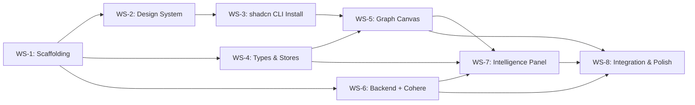

# AEGIS Review 2 Prototype — Master Task List & Tracker

> **Project**: AEGIS — Autonomous Engineering Graph & Intelligence System  
> **Scope**: Review 2 Interactive Mission Control Prototype  
> **Deliverable**: High-fidelity frontend + Minimal backend with REAL algorithms + REAL AI reasoning  
> **Architecture**: React 18 + TypeScript + Tailwind + shadcn/ui (CLI install) + React Flow | Python FastAPI + NetworkX/Neo4j + Cohere on Oracle Cloud OCI  
> **AI Provider**: Cohere Command R+ via Oracle Cloud Infrastructure (OCI) Generative AI Service  
> **Algorithm Spec**: See [`AEGIS_Algorithms.md`](./AEGIS_Algorithms.md) for all custom algorithm details  
> **Last Updated**: 27th September 2026

---

## Progress Tracker

| # | Workstream | Total Tasks | ✅ Done | 🔄 In Progress | ⬜ Not Started | Status |
|:--|:-----------|:-----------:|:-------:|:---------------:|:--------------:|:------:|
| WS-1 | Project Scaffolding & Toolchain | 7 | 7 | 0 | 0 | ✅ Done |
| WS-2 | Design System & Global Styles | 6 | 6 | 0 | 0 | ✅ Done |
| WS-3 | shadcn/ui Components (CLI Install) | 2 | 2 | 0 | 0 | ✅ Done |
| WS-4 | TypeScript Types & Zustand Stores | 8 | 8 | 0 | 0 | ✅ Done |
| WS-5 | Central Topology & Simulation Canvas | 9 | 9 | 0 | 0 | ✅ Done |
| WS-6 | Backend API, Algorithms & Cohere AI | 10 | 10 | 0 | 0 | ✅ Done |
| WS-7 | Dual-Mode Intelligence Panel & Dashboard | 12 | 12 | 0 | 0 | ✅ Done |
| WS-8 | Integration, Polish & Demo Readiness | 8 | 8 | 0 | 0 | ✅ Done |
| **TOTAL** | | **62** | **62** | **0** | **0** | **100%** |

---

## Dependency Map



---

## WS-1: Project Scaffolding & Toolchain Setup

> **Goal**: Initialize the full development environment — Git, Vite, TypeScript, Tailwind, testing, and backend Python project with OCI config.

---

### T-1.1 ⬜ Initialize Git Repository

**Description**: Initialize Git with a proper `.gitignore`.

**Subtasks**:
- [ ] Run `git init` in `c:\Users\Fawaz\Desktop\AGEIS`
- [ ] Create `.gitignore` with: `node_modules/`, `dist/`, `.vite/`, `__pycache__/`, `*.pyc`, `.env`, `.venv/`, `venv/`, `.idea/`, `.vscode/`, `*.log`, `.DS_Store`, `Thumbs.db`, `coverage/`
- [ ] Initial commit with existing documentation files

**Acceptance Criteria**:
- [ ] `git status` runs without error
- [ ] All doc files tracked; `node_modules`, `__pycache__`, `.env` ignored

---

### T-1.2 ⬜ Scaffold Frontend with Vite + React + TypeScript

**Description**: Create the Vite project with React/TS template, strict TypeScript, path aliases, and the canonical folder structure.

**Subtasks**:
- [ ] Scaffold: `npm create vite@latest frontend -- --template react-ts`
- [ ] `tsconfig.json`: `"strict": true`, `"noUncheckedIndexedAccess": true`, `"noUnusedLocals": true`, `"noUnusedParameters": true`
- [ ] Path aliases: `"@/*"` → `"./src/*"` in `tsconfig.json` + `vite.config.ts`
- [ ] Create canonical folder structure:
  ```
  src/
  ├── app/                    # globals.css, layout.tsx, page.tsx
  ├── components/
  │   ├── ui/                 # shadcn/ui (installed via CLI)
  │   ├── shared/             # DashboardShell, KPIBar
  │   ├── graph/              # Canvas, nodes, edges
  │   ├── simulation/         # Pre-ship panel components
  │   ├── healing/            # Autonomous healing components
  │   └── providers/          # Context providers
  ├── lib/
  │   ├── utils.ts            # cn() helper
  │   └── mock/               # Seed data JSON
  ├── stores/                 # Zustand stores
  └── types/                  # TypeScript interfaces
  ```
- [ ] Verify `npm run dev` starts at `localhost:5173`

**Acceptance Criteria**:
- [ ] `npx tsc --noEmit` passes with zero errors
- [ ] `npm run dev` launches with HMR
- [ ] `@/lib/utils` resolves at build time
- [ ] Folder structure matches canonical layout

---

### T-1.3 ⬜ Install & Configure Tailwind CSS + shadcn/ui Init

**Description**: Install Tailwind and initialize shadcn/ui CLI so components can be added with `npx shadcn@latest add <component>`.

**Subtasks**:
- [ ] Install Tailwind: `npm install -D tailwindcss postcss autoprefixer`
- [ ] Run `npx tailwindcss init -p`
- [ ] Configure `content` paths: `["./index.html", "./src/**/*.{ts,tsx,js,jsx}"]`
- [ ] Add Tailwind directives to `src/app/globals.css`
- [ ] Install `tailwindcss-animate`: `npm install tailwindcss-animate`
- [ ] **Initialize shadcn/ui**: `npx shadcn@latest init`
  - Select: TypeScript, Tailwind, `src/components/ui/`, `@/components/ui`, CSS variables
  - This creates `components.json`, updates `tailwind.config.ts`, creates `lib/utils.ts` with `cn()`

**Acceptance Criteria**:
- [ ] `components.json` exists with correct paths
- [ ] `cn()` utility auto-generated in `lib/utils.ts`
- [ ] `npx shadcn@latest add button` would work (test in next task)
- [ ] Tailwind classes render in browser

---

### T-1.4 ⬜ Install Core Frontend Dependencies

**Description**: Install all approved dependencies. shadcn/ui component deps are handled by the CLI — only install non-shadcn packages here.

**Subtasks**:
- [ ] **Graph & Viz**: `npm install @xyflow/react framer-motion recharts`
- [ ] **State**: `npm install zustand`
- [ ] **Icons & Toasts**: `npm install lucide-react sonner`
- [ ] **Testing**: `npm install -D vitest @testing-library/react @testing-library/jest-dom @testing-library/user-event jsdom`
- [ ] **Google Fonts** (CDN in `index.html`): Quicksand, Nunito Sans
- [ ] Verify no banned packages: no jQuery, Bootstrap, Material UI, moment.js, lodash

**Acceptance Criteria**:
- [ ] `npm install` completes without peer dependency conflicts
- [ ] `import { ReactFlow } from '@xyflow/react'` compiles
- [ ] `import { Shield } from 'lucide-react'` compiles
- [ ] No banned packages in `package.json`

---

### T-1.5 ⬜ Configure Vitest Testing Framework

**Description**: Set up Vitest with jsdom and React Testing Library.

**Subtasks**:
- [ ] Add to `vite.config.ts`: `test: { globals: true, environment: 'jsdom', setupFiles: './src/test/setup.ts', css: true }`
- [ ] Create `src/test/setup.ts` with `import '@testing-library/jest-dom'`
- [ ] Add scripts: `"test": "vitest run"`, `"test:watch": "vitest"`
- [ ] Create smoke test to verify setup

**Acceptance Criteria**:
- [ ] `npm test` runs without config errors
- [ ] `@testing-library/jest-dom` matchers work
- [ ] Tests can import from `@/` path aliases

---

### T-1.6 ⬜ Scaffold Python Backend Project (FastAPI + OCI Config)

**Description**: Initialize FastAPI backend with Cohere on Oracle Cloud OCI as the AI provider.

**Subtasks**:
- [ ] Create `backend/` directory
- [ ] Create virtual environment: `python -m venv backend/.venv`
- [ ] Create `backend/requirements.txt`:
  ```
  fastapi>=0.100.0
  uvicorn[standard]>=0.23.0
  pydantic>=2.0.0
  networkx>=3.1
  sse-starlette>=1.6.0
  httpx>=0.24.0
  neo4j>=5.0.0
  oci>=2.100.0
  cohere>=5.0.0
  python-dotenv>=1.0.0
  pytest>=7.0.0
  pytest-asyncio>=0.21.0
  ```
- [ ] Install: `pip install -r backend/requirements.txt`
- [ ] Create backend structure:
  ```
  backend/
  ├── app/
  │   ├── __init__.py
  │   ├── main.py              # FastAPI entry point with CORS
  │   ├── config.py            # OCI + Cohere settings
  │   ├── routers/
  │   │   ├── graph.py         # GET /api/graph/topology
  │   │   ├── simulation.py    # POST /api/simulate-pr
  │   │   ├── chaos.py         # POST /api/chaos/inject
  │   │   ├── healing.py       # GET /api/heal/stream (SSE)
  │   │   ├── actuator.py      # POST /api/actuator/execute
  │   │   └── memory.py        # POST /api/memory/commit
  │   ├── models/
  │   │   └── schemas.py       # Pydantic v2 models
  │   ├── services/
  │   │   ├── graph_service.py # Graph algorithms (see AEGIS_Algorithms.md)
  │   │   ├── risk_engine.py   # Risk scoring (see AEGIS_Algorithms.md)
  │   │   └── llm_agent.py     # Cohere via OCI integration
  │   └── data/
  │       └── seed_graph.py    # 54-node, 142-edge seed data
  ├── tests/
  ├── .env.example
  └── requirements.txt
  ```
- [ ] Create `backend/app/config.py` for OCI + Cohere configuration:
  ```python
  from pydantic_settings import BaseSettings
  
  class Settings(BaseSettings):
      # Oracle Cloud OCI Configuration
      OCI_CONFIG_FILE: str = "~/.oci/config"
      OCI_COMPARTMENT_ID: str = ""
      OCI_REGION: str = "us-chicago-1"
      
      # Cohere via OCI Generative AI
      OCI_GENAI_ENDPOINT: str = "https://inference.generativeai.us-chicago-1.oci.oraclecloud.com"
      COHERE_MODEL_ID: str = "cohere.command-r-plus"
      
      # Fallback: Direct Cohere API (if OCI not configured)
      COHERE_API_KEY: str = ""
      
      # App
      CORS_ORIGINS: list[str] = ["http://localhost:5173"]
      
      class Config:
          env_file = ".env"
  ```
- [ ] Create `.env.example`:
  ```env
  # Oracle Cloud OCI (primary AI provider)
  OCI_CONFIG_FILE=~/.oci/config
  OCI_COMPARTMENT_ID=ocid1.compartment.oc1..xxxxx
  OCI_REGION=us-chicago-1
  OCI_GENAI_ENDPOINT=https://inference.generativeai.us-chicago-1.oci.oraclecloud.com
  COHERE_MODEL_ID=cohere.command-r-plus
  
  # Fallback: Direct Cohere API key (if OCI not configured)
  COHERE_API_KEY=
  ```
- [ ] Create minimal `main.py` with CORS and health check
- [ ] Verify: `uvicorn app.main:app --reload` starts on port 8000

**Acceptance Criteria**:
- [ ] `GET http://localhost:8000/health` returns `{"status": "ok"}`
- [ ] FastAPI docs at `http://localhost:8000/docs`
- [ ] CORS allows `http://localhost:5173`
- [ ] OCI config structure is ready for Cohere integration
- [ ] `.env.example` documents all OCI/Cohere variables

---

### T-1.7 ⬜ Create `work.md` Work Log

**Description**: Initialize the mandatory work log per `Agents.md §7`.

**Subtasks**:
- [ ] Create `work.md` at project root
- [ ] Add first task entry

**Acceptance Criteria**:
- [ ] `work.md` exists with standard template format

---

## WS-2: Design System & Global Styles

> **Goal**: Implement the AEGIS dark mission-control design token system.

---

### T-2.1 ⬜ Define CSS Custom Properties (Design Tokens) in `globals.css`

**Description**: Implement all semantic color tokens as HSL CSS custom properties. AEGIS uses a **dark mission-control theme** by default.

**Subtasks**:
- [ ] Define `:root` tokens: `--primary`, `--primary-foreground`, `--secondary`, `--secondary-foreground`, `--tertiary`, `--tertiary-foreground`, `--success` (`142 76% 36%`), `--destructive` (`0 84.2% 60.2%`), `--background`, `--foreground`, `--card`, `--card-foreground`, `--popover`, `--popover-foreground`, `--muted`, `--muted-foreground`, `--border`, `--input`, `--ring`, `--accent`, `--accent-foreground`, `--radius: 0.75rem`
- [ ] Define `.dark` overrides with deep navy/slate backgrounds for mission-control aesthetic
- [ ] Define font variables: `--font-quicksand`, `--font-nunito`
- [ ] Add base font rules for headings and body in `@layer base`
- [ ] Add `.touch-target { min-height: 48px; min-width: 48px; }`
- [ ] Add `.scrollbar-none` utility

**Acceptance Criteria**:
- [ ] All 24+ CSS custom properties defined in `:root` and `.dark`
- [ ] `bg-primary`, `text-foreground`, `bg-card` resolve to valid colors
- [ ] Dark mode activates with `.dark` class on `<html>`
- [ ] No hardcoded hex/rgb values

---

### T-2.2 ⬜ Configure Tailwind Design Token Extensions

**Description**: Extend `tailwind.config.ts` with semantic color tokens, fonts, radius, and animations per `02-DESIGN-SYSTEM.md`.

**Subtasks**:
- [ ] Extend `colors` with all semantic tokens (primary, secondary, tertiary, destructive, success, muted, card, popover, accent)
- [ ] Extend `fontFamily`: `heading` (Quicksand), `sans` (Nunito Sans)
- [ ] Extend `borderRadius`: `lg`, `md`, `sm` using `--radius`
- [ ] Add keyframes: `accordion-down`, `accordion-up`, `pulse`

**Acceptance Criteria**:
- [ ] All semantic color classes work (`bg-primary`, `bg-success`, etc.)
- [ ] `font-heading` applies Quicksand; `font-sans` applies Nunito Sans
- [ ] `rounded-xl` = 12px; `rounded-2xl` = 16px

---

### T-2.3 ⬜ Add Google Fonts & Dark Mode Default

**Description**: Load fonts and set dark mode as default.

**Subtasks**:
- [ ] Add Google Fonts CDN links in `index.html` `<head>` (Quicksand, Nunito Sans)
- [ ] Set `<html lang="en" class="dark">`

**Acceptance Criteria**:
- [ ] Quicksand renders in headings, Nunito Sans in body
- [ ] Page loads in dark mode by default

---

### T-2.4 ⬜ Create Root Layout Component

**Description**: Build root `layout.tsx` with providers and Sonner toaster.

**Subtasks**:
- [ ] Create `src/app/layout.tsx` with dark class, global CSS import, `<Toaster />`
- [ ] Create `src/app/page.tsx` as root dashboard entry

**Acceptance Criteria**:
- [ ] Root layout renders with dark background
- [ ] `toast.success("Test")` works

---

### T-2.5 ⬜ Create AEGIS Mission Control Dashboard Shell

**Description**: Build the full-screen 4-module grid layout per the prototype spec.

**Subtasks**:
- [ ] Create `src/components/shared/DashboardShell.tsx`
- [ ] CSS Grid layout:
  ```
  ┌──────────────────────────────────────────────┐
  │ KPI Bar (Module 1) — full width              │
  ├──────────────────────────┬───────────────────┤
  │ Graph Canvas (Module 2)  │ Intelligence Panel │
  │ flex-1                   │ ~400px (Module 3)  │
  ├──────────────────────────┴───────────────────┤
  │ Timeline Scrubber (Module 4) — full width    │
  └──────────────────────────────────────────────┘
  ```
- [ ] `h-screen` full viewport, no scrolling
- [ ] `bg-background text-foreground`

**Acceptance Criteria**:
- [ ] 4-zone grid fills viewport
- [ ] No vertical scroll

---

### T-2.6 ⬜ Build KPI Summary Bar (Module 1)

**Description**: Top metrics bar with AEGIS branding and 4 KPI metrics.

**Subtasks**:
- [ ] Create `src/components/dashboard/KPIBar.tsx`
- [ ] Metrics: `Nodes: 54 | Edges: 142`, `System Health: 99.98%`, `Pre-Ship Blocked: 18 PRs`, `MTTR: 7.4s vs 35m SRE`
- [ ] AEGIS logo text + `ONLINE` status badge + motto
- [ ] Read data from Zustand stores

**Acceptance Criteria**:
- [ ] All 4 KPIs display with data from stores
- [ ] Uses `Badge`, `font-heading font-bold`, semantic tokens

---

## WS-3: shadcn/ui Components — CLI Install

> **Goal**: Install all required shadcn/ui primitives via the CLI. No hand-coding component files — shadcn handles scaffolding, theming, and Radix integration automatically.

---

### T-3.1 ⬜ Install All Required shadcn/ui Components via CLI

**Description**: Use `npx shadcn@latest add` to install every UI primitive needed for the Review 2 dashboard. This auto-generates properly themed, accessible, Radix-based components in `src/components/ui/`.

**Subtasks**:
- [ ] Install all components in one batch:
  ```bash
  npx shadcn@latest add button
  npx shadcn@latest add badge
  npx shadcn@latest add card
  npx shadcn@latest add tabs
  npx shadcn@latest add dialog
  npx shadcn@latest add input
  npx shadcn@latest add progress
  npx shadcn@latest add select
  npx shadcn@latest add dropdown-menu
  npx shadcn@latest add table
  npx shadcn@latest add accordion
  npx shadcn@latest add avatar
  npx shadcn@latest add checkbox
  npx shadcn@latest add tooltip
  npx shadcn@latest add scroll-area
  npx shadcn@latest add separator
  ```
- [ ] Verify each component file exists in `src/components/ui/`
- [ ] Verify Radix peer dependencies are auto-installed
- [ ] Verify components use the project's CSS variables (themed correctly)

**Acceptance Criteria**:
- [ ] All 16 component files exist in `src/components/ui/`
- [ ] Each component imports `cn()` from `@/lib/utils`
- [ ] Each component uses project CSS variables (`bg-primary`, `border-border`, etc.)
- [ ] `npx tsc --noEmit` passes with all components
- [ ] No manual editing of generated component files was needed (they work out of the box with the design system)

---

### T-3.2 ⬜ Customize shadcn/ui Components for AEGIS Theme

**Description**: After CLI install, apply AEGIS-specific customizations that go beyond the default shadcn theme (if any are needed).

**Subtasks**:
- [ ] **Button**: Verify base classes include `active:scale-95 touch-target font-heading font-bold` — add if missing
- [ ] **Badge**: Verify `tertiary` variant exists — add if the CLI didn't include it (shadcn default has only default/secondary/destructive/outline)
- [ ] **Card**: Verify `rounded-2xl` and `shadow-xs` — adjust if CLI generated different radius
- [ ] **Progress**: Verify `translateX` animation approach and ARIA attributes
- [ ] Run `npm test` smoke tests to verify rendering

**Acceptance Criteria**:
- [ ] Buttons have `active:scale-95`, `touch-target`, `font-heading font-bold`
- [ ] Badge has `tertiary` variant for AEGIS-specific use cases
- [ ] Cards use `rounded-2xl` (not `rounded-lg`)
- [ ] All components render correctly in dark mode
- [ ] Zero TypeScript errors

---

## WS-4: TypeScript Types & Zustand Stores

> **Goal**: Define all data models and create domain-specific Zustand stores. All UI components read exclusively from stores.

---

### T-4.1 ⬜ Define Graph Node & Edge Type Interfaces

**Description**: Create TypeScript interfaces for the 54-node, 142-edge Knowledge Graph.

**Subtasks**:
- [ ] Create `src/types/graph.ts` with: `NodeType`, `GraphNode`, `ServiceMetadata`, `DatabaseMetadata`, `PodMetadata`, `IncidentMetadata`, `EdgeType`, `GraphEdge`, `GraphTopology`
- [ ] 6 node types: `service`, `database`, `api-endpoint`, `pod`, `incident`, `decision`
- [ ] 6 edge types: `CALLS`, `DEPENDS_ON`, `EXPOSES`, `INSTANCE_OF`, `OCCURRED_IN`, `RESOLVED_BY`
- [ ] Node status: `healthy | degraded | critical | unknown`

**Acceptance Criteria**:
- [ ] All 6 node types and 6 edge types represented
- [ ] Discriminated metadata per node type
- [ ] No `any` types; `npx tsc --noEmit` passes

---

### T-4.2 ⬜ Define Simulation & Risk Score Type Interfaces

**Description**: Interfaces for pre-ship simulation, blast radius, and risk scoring. Math references → [`AEGIS_Algorithms.md`](./AEGIS_Algorithms.md) §Algorithm 1 & §Algorithm 2.

**Subtasks**:
- [ ] Create `src/types/simulation.ts`: `PullRequest`, `ContractDiff`, `BlastRadiusResult`, `RiskScoreResult`, `SimulationPhase`
- [ ] Risk components: `blastRadiusIndex` (B), `contractBreakingSeverity` (C), `circularDependencyPenalty` (D), `historicalIncidentFactor` (H)
- [ ] Verdict: `APPROVED | WARN | BLOCKED`

**Acceptance Criteria**:
- [ ] All 4 risk formula components typed
- [ ] Verdict thresholds documented in comments
- [ ] No `any` types

---

### T-4.3 ⬜ Define Incident & Healing Type Interfaces

**Description**: Interfaces for autonomous healing pipeline. Math references → [`AEGIS_Algorithms.md`](./AEGIS_Algorithms.md) §Algorithm 4 & §Algorithm 5.

**Subtasks**:
- [ ] Create `src/types/healing.ts`: `FaultType`, `ChaosInjection`, `RCAResult`, `AgentThoughtType`, `AgentThought`, `CandidateFix`, `HealingPhase`, `Incident`
- [ ] 5 fault types: `pod-crash`, `cpu-saturation`, `db-pool-exhaustion`, `latency-injection`, `memory-leak`
- [ ] Candidate fix scoring: `safetyIndex` (S), `recoveryProbability` (P), `finalScore` (F)
- [ ] Agent thought types: `thought`, `action`, `observation`, `synthesis`, `cypher-query`, `metric-fetch`

**Acceptance Criteria**:
- [ ] All fault types, healing phases, agent thought types represented
- [ ] Fix scoring formula components typed
- [ ] No `any` types

---

### T-4.4 ⬜ Define Timeline & Dashboard Type Interfaces

**Description**: Interfaces for timeline scrubber, KPIs, and view modes.

**Subtasks**:
- [ ] Create `src/types/dashboard.ts`: `TimelineState`, `TimelineEvent`, `KPIMetrics`, `GraphViewMode`
- [ ] 5 timeline states: `baseline`, `fault-injected`, `healing`, `healed`, `learned`
- [ ] 3 view modes: `topology`, `blast-radius`, `latency-heat`

**Acceptance Criteria**:
- [ ] All states and modes represented; no `any` types

---

### T-4.5 ⬜ Create `useGraphStore` Zustand Store

**Description**: Store for 54-node topology, node selection, view mode, and blast radius highlighting.

**Subtasks**:
- [ ] Create `src/stores/useGraphStore.ts` with state: `topology`, `selectedNode`, `viewMode`, `highlightedNodes`, `highlightedEdges`, `isLoading`
- [ ] Actions: `setTopology`, `selectNode`, `setViewMode`, `highlightBlastRadius`, `clearHighlights`, `updateNodeStatus`, `addIncidentNode`
- [ ] Seed from `src/lib/mock/topology.json` on init

**Acceptance Criteria**:
- [ ] Initializes with 54 nodes, 142 edges
- [ ] All actions work with type safety
- [ ] No `any` types

---

### T-4.6 ⬜ Create `useSimulationStore` Zustand Store

**Description**: Store for pre-deployment risk simulation workflow.

**Subtasks**:
- [ ] Create `src/stores/useSimulationStore.ts`: `selectedPR`, `availablePRs`, `simulationPhase`, `blastRadius`, `riskScore`, `isRunning`, `totalBlockedPRs`
- [ ] Actions: `selectPR`, `runSimulation`, `resetSimulation`
- [ ] Seed 3 sample PRs: Safe (#138), Moderate (#140), Breaking (#142)

**Acceptance Criteria**:
- [ ] Full simulation lifecycle managed
- [ ] Phase transitions: idle → analyzing → traversing → scoring → complete

---

### T-4.7 ⬜ Create `useHealingStore` Zustand Store

**Description**: Store for autonomous healing pipeline: chaos injection, RCA streaming, fix execution.

**Subtasks**:
- [ ] Create `src/stores/useHealingStore.ts`: `currentIncident`, `healingPhase`, `agentThoughts`, `candidateFixes`, `selectedFix`, `executionProgress`, `isStreaming`, `deadManSwitchActive`
- [ ] Actions: `injectChaos`, `appendAgentThought`, `setCandidateFixes`, `executeFix`, `commitToMemory`, `resetHealing`
- [ ] SSE integration: `injectChaos` opens EventSource to `/api/heal/stream`

**Acceptance Criteria**:
- [ ] Full healing pipeline managed
- [ ] Agent thoughts appended incrementally (SSE streaming)
- [ ] Connects to `useGraphStore` for incident node addition

---

### T-4.8 ⬜ Create `useTimelineStore` and Seed All Mock Data

**Description**: Timeline store + all seed mock data JSON files.

**Subtasks**:
- [ ] Create `src/stores/useTimelineStore.ts`
- [ ] Create `src/lib/mock/topology.json` — 54 nodes, 142 edges:
  - 8 services: `API Gateway`, `AuthService`, `OrderService`, `PaymentService`, `InventoryService`, `NotificationService`, `ShippingService`, `AnalyticsWorker`
  - 6 databases: PostgreSQL (Orders), PostgreSQL (Payments), Redis (Session), Redis (RateLimit), MongoDB (Product Catalog), Kafka
  - 20+ API endpoints, 20+ Pods
- [ ] Create `src/lib/mock/pull-requests.json` — 3 PRs
- [ ] Create `src/lib/mock/incidents.json` — sample history
- [ ] All JSON conforms to TypeScript interfaces

**Acceptance Criteria**:
- [ ] `topology.json` has exactly 54 nodes, 142 edges
- [ ] All 8 services + 6 databases match prototype spec
- [ ] PR #142 has `breakingChange: true`

---

## WS-5: Central Topology & Simulation Canvas (Module 2)

> **Goal**: Interactive React Flow graph canvas with custom nodes, animated edges, and blast radius overlays.

---

### T-5.1 ⬜ React Flow Canvas Setup

**Description**: Initialize React Flow within the dashboard grid with dark theme.

**Subtasks**:
- [ ] Create `src/components/graph/SimulationGraphCanvas.tsx`
- [ ] `<ReactFlow>` with dark background, minimap, zoom controls, `fitView`
- [ ] Wire to `useGraphStore.topology`

**Acceptance Criteria**:
- [ ] Canvas renders in Module 2 area; pan/zoom works; dark background

---

### T-5.2 ⬜ Custom Service Node Component

**Description**: Custom React Flow node for microservice nodes.

**Subtasks**:
- [ ] Create `src/components/graph/nodes/ServiceNode.tsx`
- [ ] Rounded card with icon, service name (`font-heading font-bold`), status dot (green/amber/red), compact metrics (latency, error rate)
- [ ] States: `healthy` (default), `degraded` (amber glow), `critical` (red pulse via Framer Motion)
- [ ] Register as `nodeTypes={{ service: ServiceNode }}`

**Acceptance Criteria**:
- [ ] Nodes render with icon, name, status, metrics
- [ ] Critical nodes pulse red; design tokens used throughout

---

### T-5.3 ⬜ Custom Database Node Component

**Description**: Custom React Flow node for database/storage nodes, visually distinct from services.

**Subtasks**:
- [ ] Create `src/components/graph/nodes/DatabaseNode.tsx`
- [ ] Distinct shape (cylinder-like or different color), DB type indicator, connection pool status

**Acceptance Criteria**:
- [ ] Visually distinct from service nodes; pool utilization visible

---

### T-5.4 ⬜ Custom Pod Node Component

**Description**: Compact React Flow node for Kubernetes pod instances.

**Subtasks**:
- [ ] Create `src/components/graph/nodes/PodNode.tsx`
- [ ] Small pill/circle, status color (green/red/yellow), visually near parent service

**Acceptance Criteria**:
- [ ] Pods are smaller than service nodes; status visible via color

---

### T-5.5 ⬜ Custom Incident Node Component

**Description**: Distinctive node for dynamically-added `:Incident` nodes with entry animation.

**Subtasks**:
- [ ] Create `src/components/graph/nodes/IncidentNode.tsx`
- [ ] Distinctive shape (hexagon/warning), orange/amber, incident ID + type badge
- [ ] Framer Motion: fade-in + scale-up entry animation

**Acceptance Criteria**:
- [ ] Visually distinctive; appears with animation when added

---

### T-5.6 ⬜ Animated Edge Components

**Description**: SVG particle dots flowing along edges to represent traffic.

**Subtasks**:
- [ ] Create `src/components/graph/edges/AnimatedEdge.tsx`
- [ ] Particle dots along edge paths; color: default (muted), active (primary), fault (destructive)
- [ ] Speed varies by latency; edge labels for type

**Acceptance Criteria**:
- [ ] Dots flow in correct direction; fault edges turn red; smooth animation

---

### T-5.7 ⬜ Blast Radius Visual Overlay

**Description**: Highlight affected nodes with glowing halos when simulation runs.

**Subtasks**:
- [ ] Create `src/components/graph/BlastRadiusOverlay.tsx`
- [ ] Read `highlightedNodes` from store; depth 0 = red glow, depth 1 = amber, depth 2+ = subtle
- [ ] Non-affected nodes dim; Framer Motion outward expansion animation

**Acceptance Criteria**:
- [ ] Blast radius visually propagates outward; intensity attenuates with depth

---

### T-5.8 ⬜ Node Inspect Flyout Panel

**Description**: Metadata drawer on node click showing connected entities and metrics.

**Subtasks**:
- [ ] Create `src/components/graph/NodeInspectPanel.tsx`
- [ ] Context-aware display per node type (service/database/pod/incident)
- [ ] Uses shadcn/ui Card, Badge, Table; dismissible

**Acceptance Criteria**:
- [ ] Click opens panel; correct metadata per type; uses shadcn/ui primitives

---

### T-5.9 ⬜ Graph View Mode Tabs

**Description**: 3-mode view tabs: Topology, Blast Radius, Latency Heat.

**Subtasks**:
- [ ] Create `src/components/graph/GraphViewTabs.tsx`
- [ ] shadcn/ui Tabs: Topology (default), Blast Radius (impact cone), Latency Heat (color by latency)
- [ ] Wire to `useGraphStore.setViewMode()`

**Acceptance Criteria**:
- [ ] Tab switching changes graph visual mode; active tab distinct

---

## WS-6: Backend API, Real Algorithms & Cohere AI on OCI

> **Goal**: FastAPI backend with real graph algorithms (per [`AEGIS_Algorithms.md`](./AEGIS_Algorithms.md)), Cohere RCA agent via Oracle Cloud OCI, and 6 REST/SSE endpoints.

---

### T-6.1 ⬜ Build 54-Node Graph Seed Data in NetworkX

**Description**: Build the complete 54-node, 142-edge in-memory graph representing the sandbox microservice architecture.

**Subtasks**:
- [ ] Create `backend/app/data/seed_graph.py`
- [ ] 8 services, 6 databases, 20+ API endpoints, 20+ Pods
- [ ] 142 typed edges: `CALLS`, `DEPENDS_ON`, `EXPOSES`, `INSTANCE_OF`
- [ ] Realistic attribute values (latencies 10ms–500ms, pool sizes, error rates)
- [ ] `get_graph()` returns built NetworkX DiGraph

**Acceptance Criteria**:
- [ ] `len(graph.nodes) == 54`, `len(graph.edges) == 142`
- [ ] All 8 services + 6 databases present
- [ ] Serializes to React Flow JSON format

---

### T-6.2 ⬜ Implement `GET /api/graph/topology`

**Description**: Serve graph topology in React Flow format.

**Subtasks**:
- [ ] Create `backend/app/routers/graph.py`
- [ ] Convert NetworkX graph to React Flow JSON: `{ nodes: [...], edges: [...] }`
- [ ] Pydantic response model

**Acceptance Criteria**:
- [ ] Returns 54 nodes, 142 edges in React Flow format
- [ ] Positions create readable layout

---

### T-6.3 ⬜ Implement Algorithm 1: BFS Blast Radius

**Description**: Real BFS blast radius with depth attenuation per [`AEGIS_Algorithms.md`](./AEGIS_Algorithms.md) §Algorithm 1.

**Subtasks**:
- [ ] Implement `compute_blast_radius()` in `graph_service.py`
- [ ] BFS over `CALLS` + `DEPENDS_ON` predecessors
- [ ] Attenuation factor: `0.75` per depth, max depth: `3`
- [ ] Unit tests against known graph structure

**Acceptance Criteria**:
- [ ] Traverses upstream; weight attenuates 0.75× per depth
- [ ] No infinite loops on cycles; stops at depth 3
- [ ] Passes unit tests from Algorithm doc worked example

---

### T-6.4 ⬜ Implement Algorithm 2: Composite Risk Score

**Description**: Weighted risk formula per [`AEGIS_Algorithms.md`](./AEGIS_Algorithms.md) §Algorithm 2.

**Subtasks**:
- [ ] Implement `compute_risk_score()` in `risk_engine.py`
- [ ] $R = 0.35B + 0.30C + 0.15D + 0.20H$ — clamped [0,100]
- [ ] Tarjan's SCC for circular dependency (D)
- [ ] Verdict: APPROVED ≤ 40, WARN ≤ 70, BLOCKED > 70

**Acceptance Criteria**:
- [ ] Formula matches spec exactly
- [ ] PR #142 → high score; Safe PR → low score
- [ ] Unit tests verify against 3+ known inputs

---

### T-6.5 ⬜ Implement `POST /api/simulate-pr`

**Description**: Wire blast radius + risk scoring into REST endpoint.

**Subtasks**:
- [ ] Create `backend/app/routers/simulation.py`
- [ ] Accept: `{ pr_id, target_node, contract_diff }`
- [ ] Execute Algorithm 1 → Algorithm 2 → return results
- [ ] Pydantic request/response models

**Acceptance Criteria**:
- [ ] Returns real-time computed risk score
- [ ] Includes all 4 components (B, C, D, H), verdict, affected services

---

### T-6.6 ⬜ Implement `POST /api/chaos/inject`

**Description**: Chaos injection modifying graph telemetry to simulate faults.

**Subtasks**:
- [ ] Create `backend/app/routers/chaos.py`
- [ ] Each fault type modifies node attributes:
  - `pod-crash`: pod status → CrashLoopBackOff, service → critical
  - `cpu-saturation`: CPU → 95%+, latency → 3500ms
  - `db-pool-exhaustion`: pool → max/max (exhausted)
  - `latency-injection`: P99 → 3000ms+
  - `memory-leak`: memory → 95%+

**Acceptance Criteria**:
- [ ] Each fault type produces correct telemetry changes
- [ ] New incident created with unique ID

---

### T-6.7 ⬜ Implement Cohere on OCI LLM Agent + `GET /api/heal/stream` SSE

**Description**: Build the graph-grounded RCA agent using **Cohere Command R+** via Oracle Cloud OCI Generative AI Service, streaming reasoning tokens over SSE.

**Subtasks**:
- [ ] Create `backend/app/services/llm_agent.py` with OCI + Cohere integration:
  ```python
  import oci
  from oci.generative_ai_inference import GenerativeAiInferenceClient
  from oci.generative_ai_inference.models import (
      CohereChatRequest,
      OnDemandServingMode,
      ChatDetails,
  )
  
  class AEGISAgent:
      def __init__(self, config: Settings):
          # Primary: OCI Generative AI with Cohere
          self.oci_config = oci.config.from_file(config.OCI_CONFIG_FILE)
          self.client = GenerativeAiInferenceClient(
              self.oci_config,
              service_endpoint=config.OCI_GENAI_ENDPOINT,
          )
          self.compartment_id = config.OCI_COMPARTMENT_ID
          self.model_id = config.COHERE_MODEL_ID
      
      async def diagnose(self, subgraph_context: dict, anomaly: dict):
          """Run graph-grounded RCA using Cohere Command R+ on OCI."""
          system_prompt = self._build_system_prompt()
          user_prompt = self._build_user_prompt(subgraph_context, anomaly)
          
          chat_request = CohereChatRequest(
              message=user_prompt,
              preamble_override=system_prompt,
              max_tokens=1024,
              temperature=0.3,
              is_stream=True,
          )
          
          chat_detail = ChatDetails(
              compartment_id=self.compartment_id,
              serving_mode=OnDemandServingMode(model_id=self.model_id),
              chat_request=chat_request,
          )
          
          response = self.client.chat(chat_detail)
          # Stream tokens...
  ```
- [ ] Implement the 3-phase pipeline:
  1. **Subgraph Extraction**: Algorithm 3 from [`AEGIS_Algorithms.md`](./AEGIS_Algorithms.md)
  2. **Graph-Grounded RCA Prompt**: System prompt forcing Cohere to reason only over provided topology
  3. **SSE Streaming**: Stream response tokens via `sse-starlette`
- [ ] Create `backend/app/routers/healing.py` with `GET /api/heal/stream`
- [ ] SSE event types: `thought`, `action`, `observation`, `synthesis`, `candidate-fixes`
- [ ] **Fallback**: If OCI/Cohere not configured, use direct `cohere` Python SDK with API key
- [ ] **Demo fallback**: If no API key at all, serve a pre-scripted realistic reasoning trace

**Acceptance Criteria**:
- [ ] SSE endpoint streams tokens in real-time
- [ ] LLM prompt includes actual graph neighborhood (not generic text)
- [ ] Agent produces: root cause, confidence %, propagation path, remediations
- [ ] Works via OCI Generative AI (primary) or direct Cohere API (fallback)
- [ ] Pre-scripted trace available for offline/no-API-key demos
- [ ] Async, non-blocking streaming

---

### T-6.8 ⬜ Implement Algorithm 4: Candidate Fix Safety Scoring

**Description**: Score and rank candidate fixes per [`AEGIS_Algorithms.md`](./AEGIS_Algorithms.md) §Algorithm 4.

**Subtasks**:
- [ ] Implement `score_candidate_fixes()` in `risk_engine.py`
- [ ] $F_k = 0.6 \cdot S_k + 0.4 \cdot P_k$; gate: $S_k \geq 75$
- [ ] Pre-defined risk profiles per action type
- [ ] Generate 3 candidates per fault; rank by F_k

**Acceptance Criteria**:
- [ ] Scoring matches formula; only S_k ≥ 75 eligible
- [ ] Ranked by F_k descending; passes worked example test

---

### T-6.9 ⬜ Implement `POST /api/actuator/execute` with Dead-Man's Switch

**Description**: Guarded fix execution with health probes per [`AEGIS_Algorithms.md`](./AEGIS_Algorithms.md) §Algorithm 5.

**Subtasks**:
- [ ] Create `backend/app/routers/actuator.py`
- [ ] Implement `execute_with_deadman_switch()`:
  - Apply fix → 2s delay → health probe → healed or rollback
  - Probe: latency < 500ms AND error rate < 5% AND status == healthy
  - Max retries: 3, timeout: 10s
- [ ] Track execution progress (0% → 50% → 100%)
- [ ] Auto-rollback restores pre-fix state

**Acceptance Criteria**:
- [ ] Health probe runs after fix; successful healing restores status
- [ ] Dead-man's switch triggers rollback on failure
- [ ] Progress trackable; graph state updated

---

### T-6.10 ⬜ Implement `POST /api/memory/commit` (Feedback Writer)

**Description**: Commit incident to the Knowledge Graph, closing the AEGIS loop.

**Subtasks**:
- [ ] Create `backend/app/routers/memory.py`
- [ ] Add `(:Incident)` node + `[:OCCURRED_IN]` + `[:RESOLVED_BY]` edges
- [ ] Update historical incident factor (H) for the target service
- [ ] Re-running `POST /api/simulate-pr` must show higher risk score (learning proof)

**Acceptance Criteria**:
- [ ] Incident node + edges created
- [ ] H factor increases for target service
- [ ] Re-simulation shows higher risk score → **CLOSED-LOOP LEARNING PROVED**

---

## WS-7: Dual-Mode Intelligence Panel & Dashboard (Module 3 + Module 4)

> **Goal**: Build the complete dual-tab intelligence panel and timeline scrubber.

---

### T-7.1 ⬜ Intelligence Panel Shell with Dual Tabs

**Description**: Panel with Tab 1 ("See Every Risk") and Tab 2 ("Heal Every Failure").

**Subtasks**:
- [ ] Create `src/components/dashboard/IntelligencePanel.tsx`
- [ ] shadcn/ui `Tabs` with Lucide icons: `Shield` (Tab 1), `Activity` (Tab 2)
- [ ] Right column (~400px), full height, scrollable content

**Acceptance Criteria**:
- [ ] Two tabs switch content; icons visible; fits right column

---

### T-7.2 ⬜ Tab 1: Pull Request Selector

**Description**: PR dropdown for selecting simulation targets.

**Subtasks**:
- [ ] Create `src/components/simulation/PRSelector.tsx`
- [ ] shadcn/ui `Select` with 3 PRs: Safe (#138), Moderate (#140), Breaking (#142)
- [ ] Wire to `useSimulationStore.selectPR()`

**Acceptance Criteria**:
- [ ] Selection updates store; PR details display after selection

---

### T-7.3 ⬜ Tab 1: Simulation Trigger & Risk Gauge

**Description**: "Run Pre-Ship Simulation" button + risk score radial gauge + scorecard.

**Subtasks**:
- [ ] Create `src/components/simulation/SimulationTrigger.tsx` — Button with loading/phase indicator
- [ ] Create `src/components/simulation/RiskScoreGauge.tsx` — Radial gauge 0-100 (Recharts or SVG), color by verdict
- [ ] Create `src/components/simulation/RiskScorecard.tsx` — 4 components (B, C, D, H) breakdown
- [ ] Trigger blast radius highlights on graph canvas

**Acceptance Criteria**:
- [ ] Simulation runs with phase transitions
- [ ] Gauge shows score with correct color (green/amber/red)
- [ ] All 4 risk components displayed individually
- [ ] PR #142 → BLOCKED; Safe PR → APPROVED

---

### T-7.4 ⬜ Tab 1: CI/CD Gating Shield Badge

**Description**: GitHub-style merge gate status card.

**Subtasks**:
- [ ] Create `src/components/simulation/CICDShieldBadge.tsx`
- [ ] Approved: green `"✓ AEGIS Shield: Merge Approved"` / Blocked: red `"✕ Merge Blocked — Risk 86/100"`

**Acceptance Criteria**:
- [ ] Toggles based on verdict; animated transition

---

### T-7.5 ⬜ Tab 2: Chaos Injection Controls

**Description**: Fault selection + trigger button.

**Subtasks**:
- [ ] Create `src/components/healing/ChaosInjector.tsx`
- [ ] shadcn/ui `Select` for 5 fault types; auto-populate target
- [ ] `Button` variant `destructive`: `"⚡ Trigger Failure"`
- [ ] Confirmation dialog before injection

**Acceptance Criteria**:
- [ ] All 5 faults selectable; confirmation required; triggers graph state change

---

### T-7.6 ⬜ Tab 2: AI Reasoning Terminal (Typewriter Stream)

**Description**: Streaming terminal with typewriter effect showing Cohere agent's reasoning.

**Subtasks**:
- [ ] Create `src/components/healing/AIReasoningTerminal.tsx`
- [ ] Dark monospace terminal; subscribe to `useHealingStore.agentThoughts`
- [ ] Type-specific styling: 💭 thought (italic), ⚡ action (bold + Cypher highlight), 📊 observation (data), 🎯 synthesis (conclusion block)
- [ ] Typewriter effect; auto-scroll; blinking cursor

**Acceptance Criteria**:
- [ ] Terminal renders with distinct styling per thought type
- [ ] Typewriter feels realistic; auto-scrolls; no performance lag

---

### T-7.7 ⬜ Tab 2: Candidate Fix Cards

**Description**: Ranked remediation cards with safety scores.

**Subtasks**:
- [ ] Create `src/components/healing/CandidateFixCard.tsx`
- [ ] Each card: name, Safety Index (S), Recovery Probability (P), Final Score (F), "Execute Fix" button
- [ ] Ranked by F descending; recommended fix highlighted; S < 75 disabled

**Acceptance Criteria**:
- [ ] 3 cards ranked by F; unsafe fixes disabled; uses shadcn/ui Card/Badge/Progress/Button

---

### T-7.8 ⬜ Tab 2: Execution Progress & Dead-Man's Switch

**Description**: Fix execution progress bar + health probe + rollback status.

**Subtasks**:
- [ ] Create `src/components/healing/ExecutionProgress.tsx`
- [ ] shadcn/ui Progress bar; phase labels; Dead-Man's Switch badge (ARMED/TRIGGERED/VERIFIED)
- [ ] Create `src/components/healing/PostmortemCard.tsx` — auto postmortem with TTD/TTDiag/TTH + "Commit to Knowledge Graph" button

**Acceptance Criteria**:
- [ ] Progress animates; dead-man switch visible; postmortem appears after healing

---

### T-7.9 ⬜ Tab 2: Incident Memory Writer Animation

**Description**: Animate new incident node onto graph canvas upon memory commit.

**Subtasks**:
- [ ] Create `src/components/healing/IncidentMemoryBadge.tsx`
- [ ] On commit: add incident node to graph → animate entry → toast confirmation
- [ ] Show updated risk score proving learning: `"Risk: 86 → 91"`

**Acceptance Criteria**:
- [ ] New node appears with animation; risk score increases; toast confirms

---

### T-7.10 ⬜ Timeline Scrubber (Module 4)

**Description**: Interactive timeline slider with 5 discrete states.

**Subtasks**:
- [ ] Create `src/components/dashboard/TimelineScrubber.tsx`
- [ ] Full-width slider with 5 labeled points: Baseline, Fault Injected, Healing, Healed, Learned
- [ ] Scrubbing updates graph + intelligence panel state
- [ ] Play/Pause auto-advance

**Acceptance Criteria**:
- [ ] 5 labeled points; clicking jumps to state; play auto-advances

---

### T-7.11 ⬜ Dynamic Event Log Feed

**Description**: Chronological event log showing agent actions and graph changes.

**Subtasks**:
- [ ] Create `src/components/dashboard/EventLogFeed.tsx`
- [ ] Timestamped events with icons; auto-scroll

**Acceptance Criteria**:
- [ ] Events in chronological order; auto-scrolls; compact design

---

### T-7.12 ⬜ Contract Diff Viewer

**Description**: Display the PR's API contract changes for the pre-ship simulation tab.

**Subtasks**:
- [ ] Create `src/components/simulation/ContractDiffViewer.tsx`
- [ ] Show added/removed/modified fields in diff format (green/red highlighting)
- [ ] Wire to `useSimulationStore.selectedPR.contractDiff`

**Acceptance Criteria**:
- [ ] Breaking changes highlighted in red; additions in green

---

## WS-8: Integration, Polish & Demo Readiness

> **Goal**: Wire everything end-to-end, verify the AEGIS loop, polish for live demonstration.

---

### T-8.1 ⬜ Frontend ↔ Backend API Integration

**Description**: Connect all stores to backend endpoints.

**Subtasks**:
- [ ] Create `src/lib/api.ts` — centralized API client for all 6 endpoints
- [ ] Update stores to call API endpoints
- [ ] SSE stream handling in `useHealingStore` for Cohere agent thoughts
- [ ] Loading states + error handling
- [ ] Create `.env` with `VITE_API_URL=http://localhost:8000`
- [ ] Fallback: use mock data if backend unavailable

**Acceptance Criteria**:
- [ ] All stores connect to backend; SSE streams work
- [ ] Graceful fallback to mock data
- [ ] No `fetch()` in components — all through stores via `api.ts`

---

### T-8.2 ⬜ End-to-End Demo Flow Verification

**Description**: Verify complete AEGIS loop in 6 steps.

**Subtasks**:
- [ ] **Step 1 — Predict**: PR #142 → Simulation → blast radius → risk > 70 → BLOCKED
- [ ] **Step 2 — Inject**: DB Pool Exhaustion → PaymentService red → latency spike
- [ ] **Step 3 — Diagnose**: Cohere streams reasoning → Cypher queries → root cause > 90% confidence
- [ ] **Step 4 — Heal**: 3 candidates → execute best → progress → health probe passes → green
- [ ] **Step 5 — Learn**: Commit → incident node on graph → re-simulate → risk 86 → 91
- [ ] **Step 6 — Replay**: Timeline scrub → graph/panel update at each state

**Acceptance Criteria**:
- [ ] All 6 steps complete without errors
- [ ] AEGIS loop fully closed; risk score increases (learning proved)
- [ ] Demo time: ~4 minutes

---

### T-8.3 ⬜ UI Animation Polish

**Description**: Refine all animations for professional demo quality.

**Subtasks**:
- [ ] `active:scale-95 transition-all` on all buttons
- [ ] Framer Motion pulse rings on critical nodes
- [ ] Blast radius expansion animation
- [ ] Typewriter cursor blink
- [ ] Candidate fix cards stagger-in
- [ ] Progress bar smooth fill
- [ ] Incident node spawn animation
- [ ] All animations < 500ms

**Acceptance Criteria**:
- [ ] 60fps animations; professional mission-control feel

---

### T-8.4 ⬜ Dark Mode & Contrast Verification

**Description**: Verify entire dashboard in dark mission-control theme.

**Subtasks**:
- [ ] Verify all surfaces use `bg-card`/`bg-background` (no `bg-white`)
- [ ] Verify WCAG AA contrast ratios
- [ ] Graph nodes visible on dark canvas
- [ ] No hardcoded colors

**Acceptance Criteria**:
- [ ] Consistent dark theme; all text meets contrast requirements

---

### T-8.5 ⬜ TypeScript Compilation Pass

**Description**: Clean compilation with zero errors.

**Subtasks**:
- [ ] `npx tsc --noEmit` — zero errors
- [ ] No `any` types in production code

**Acceptance Criteria**:
- [ ] Exit code 0; zero `any` types

---

### T-8.6 ⬜ Unit Test Suite Pass

**Description**: All tests pass.

**Subtasks**:
- [ ] `npm test` — 100% pass rate
- [ ] Verify shadcn/ui components render (smoke tests)
- [ ] Store integration tests for simulation and healing workflows

**Acceptance Criteria**:
- [ ] Exit code 0; 100% pass rate

---

### T-8.7 ⬜ Backend Test Suite

**Description**: Verify all 6 endpoints and 5 algorithms.

**Subtasks**:
- [ ] Test topology (54 nodes, 142 edges)
- [ ] Test blast radius algorithm (known inputs/outputs from AEGIS_Algorithms.md)
- [ ] Test risk score formula (3+ known cases)
- [ ] Test chaos injection
- [ ] Test fix scoring
- [ ] Test health probe & rollback
- [ ] Test memory commit & learning proof
- [ ] Run `pytest backend/tests/ -v`

**Acceptance Criteria**:
- [ ] All backend tests pass; algorithms verified against AEGIS_Algorithms.md worked examples

---

### T-8.8 ⬜ Demo Setup Script & Documentation

**Description**: One-command setup + README for running the Review 2 demo.

**Subtasks**:
- [ ] Create `README.md`: overview, architecture, prerequisites (Node 18+, Python 3.11+, OCI config), setup steps, demo walkthrough, KPI targets
- [ ] Create `scripts/start-demo.ps1`:
  ```powershell
  # Start backend
  Start-Process powershell -ArgumentList "cd backend; .\.venv\Scripts\activate; uvicorn app.main:app --reload"
  # Start frontend
  Start-Process powershell -ArgumentList "cd frontend; npm run dev"
  ```
- [ ] Document OCI setup: how to configure `~/.oci/config`, compartment ID, model ID
- [ ] Create `.env.example` for frontend and backend
- [ ] Update `work.md` with all completed tasks

**Acceptance Criteria**:
- [ ] Fresh clone → install → run works
- [ ] OCI/Cohere setup documented
- [ ] `work.md` up to date

---

## Quick Reference: File Inventory

| Category | Files | Count |
|:---------|:------|:-----:|
| **Config** | `package.json`, `tsconfig.json`, `vite.config.ts`, `tailwind.config.ts`, `postcss.config.js`, `components.json`, `.gitignore`, `.env`, `.env.example` | 9 |
| **Global Styles** | `src/app/globals.css` | 1 |
| **Layout** | `src/app/layout.tsx`, `src/app/page.tsx` | 2 |
| **UI Primitives** | Installed via `npx shadcn@latest add` — auto-generated in `src/components/ui/` | ~16 |
| **Utilities** | `src/lib/utils.ts` (auto by shadcn), `src/lib/api.ts` | 2 |
| **Types** | `graph.ts`, `simulation.ts`, `healing.ts`, `dashboard.ts` | 4 |
| **Stores** | `useGraphStore.ts`, `useSimulationStore.ts`, `useHealingStore.ts`, `useTimelineStore.ts` | 4 |
| **Mock Data** | `topology.json`, `pull-requests.json`, `incidents.json` | 3 |
| **Graph Components** | `SimulationGraphCanvas.tsx`, `ServiceNode.tsx`, `DatabaseNode.tsx`, `PodNode.tsx`, `IncidentNode.tsx`, `AnimatedEdge.tsx`, `BlastRadiusOverlay.tsx`, `NodeInspectPanel.tsx`, `GraphViewTabs.tsx` | 9 |
| **Dashboard Components** | `DashboardShell.tsx`, `KPIBar.tsx`, `IntelligencePanel.tsx`, `TimelineScrubber.tsx`, `EventLogFeed.tsx` | 5 |
| **Simulation Components** | `PRSelector.tsx`, `SimulationTrigger.tsx`, `RiskScoreGauge.tsx`, `RiskScorecard.tsx`, `CICDShieldBadge.tsx`, `ContractDiffViewer.tsx` | 6 |
| **Healing Components** | `ChaosInjector.tsx`, `AIReasoningTerminal.tsx`, `CandidateFixCard.tsx`, `ExecutionProgress.tsx`, `PostmortemCard.tsx`, `IncidentMemoryBadge.tsx` | 6 |
| **Backend** | `main.py`, `config.py`, `schemas.py`, `seed_graph.py`, `graph_service.py`, `risk_engine.py`, `llm_agent.py` + 6 routers + tests | ~19 |
| **Docs** | `README.md`, `work.md`, `AEGIS_Algorithms.md`, `scripts/start-demo.ps1` | 4 |
| **TOTAL** | | **~90** |

---

## KPI Targets for Review 2

| Metric | Target | How Demonstrated |
|:-------|:-------|:-----------------|
| **Time-to-Detect** | < 2.0s | Anomaly detection after chaos injection |
| **Time-to-Diagnose** | < 4.5s | Cohere RCA via 2-hop graph traversal |
| **Time-to-Heal** | < 10.0s | Fix execution + health probe |
| **Autonomous MTTR** | ~7.4s | TTD + TTDiag + TTH |
| **Diagnosis Accuracy** | > 92% | Root cause matches injected fault |
| **Topology Scale** | 54 nodes, 142 edges | Full graph on canvas |
| **Pre-Ship Blocked** | 18 PRs | Historical gating count |
| **Learning Proof** | Risk score Δ > 0 | Score increases after memory commit |

---

## Referenced Documents

| Document | Path | Relevance |
|:---------|:-----|:----------|
| [AEGIS Algorithms Spec](./AEGIS_Algorithms.md) | `./AEGIS_Algorithms.md` | All 5 custom algorithm formulas, pseudocode, worked examples |
| [Project Proposal](./AEGIS-Major-Project-Proposal.md) | `./AEGIS-Major-Project-Proposal.md` | Requirements, AEGIS Loop, architecture |
| [Tech Stack](./AEGIS_Tech_Stack_Document.md) | `./AEGIS_Tech_Stack_Document.md` | Technology selections, graph schema, API contracts |
| [Architecture](./design-principals/01-ARCHITECTURE.md) | `design-principals/01-ARCHITECTURE.md` | Folder structure, routing, state management |
| [Design System](./design-principals/02-DESIGN-SYSTEM.md) | `design-principals/02-DESIGN-SYSTEM.md` | Color tokens, typography, spacing, animations |
| [UI Components](./design-principals/03-UI-COMPONENTS.md) | `design-principals/03-UI-COMPONENTS.md` | Component specs, anti-hallucination rules |
| [Agent Standards](./Agents.md) | `./Agents.md` | AI agent behavioral rules, workflow, quality gates |

---

*End of AEGIS Review 2 Prototype Master Task List*
